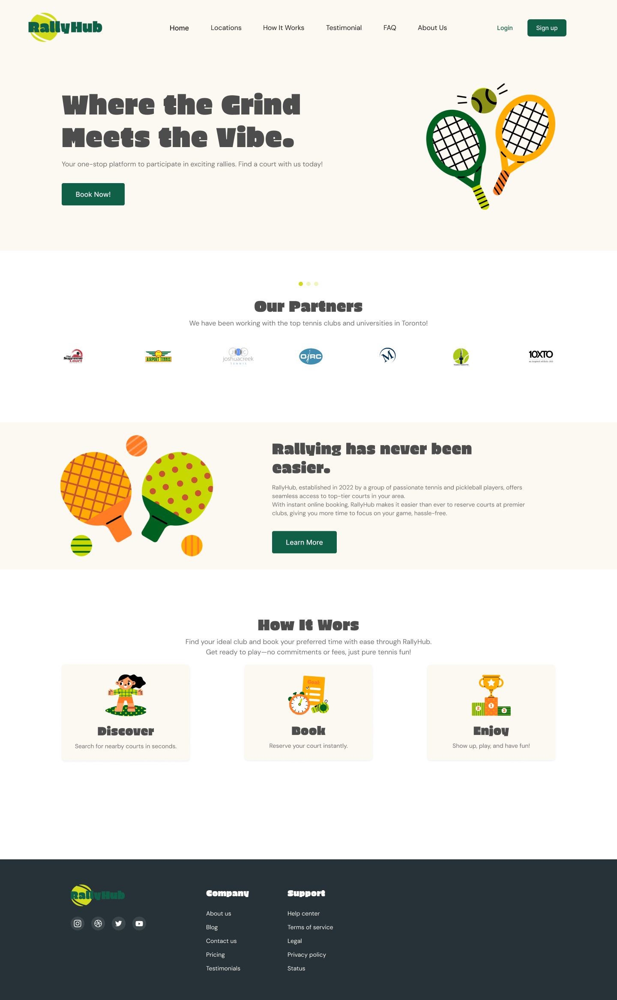
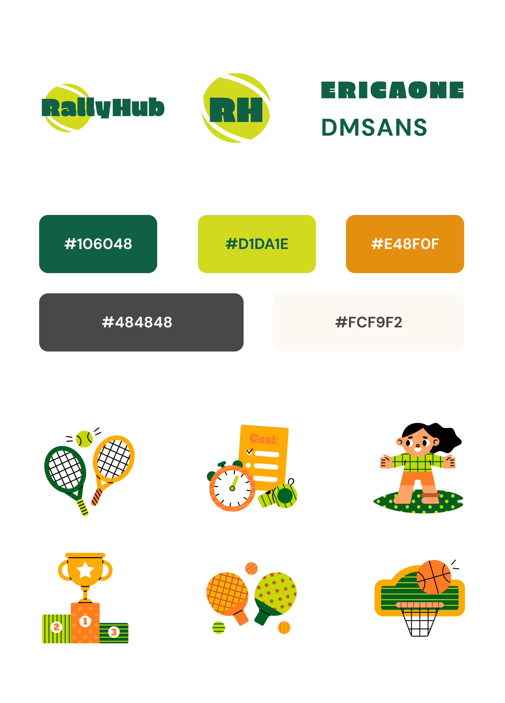

# Tennis Court Booking System

## Project Overview

This project is a full-stack web application designed to streamline the process of booking tennis courts across various clubs and municipalities. It provides an intuitive interface for users to select their preferred location, club, date, and time for their tennis sessions.

[Watch the video](client/src/Assets/demo/rallyhub_demo_video.mp4)




## Features

- User authentication
- Location-based club selection
- Real-time availability checking
- Easy-to-use booking interface
- Responsive design for mobile and desktop use

## Tech Stack

### Frontend
- React.js
- Tailwind CSS for styling
- React Hook Form for form handling
- React Hot Toast for notifications

### Backend
- Node.js
- Express.js
- Prisma ORM for database operations

### Database
- PostgreSQL

### Authentication
- Firebase Authentication

## Getting Started

### Prerequisites

- Node.js (v14 or later)
- npm or yarn
- PostgreSQL database
- Firebase project (for authentication)

### Installation

1. Clone the repository:
   ```
   git clone https://github.com/sophielluo/rallyhub.git
   ```

2. Navigate to the project directory:
   ```
   cd rallyhub
   ```

3. Install dependencies:
   ```
   npm install
   ```

4. Set up your environment variables:
   Create a `.env` file in the root directory and add the following:
   ```
   DATABASE_URL="your-postgresql-connection-string"
   FIREBASE_API_KEY="your-firebase-api-key"
   ```

5. Run database migrations:
   ```
   npx prisma migrate dev
   ```

6. Start the development server:
   ```
   npm run dev
   ```

7. Open your browser and navigate to `http://localhost:3000` to view the application.

## Contributing

Contributions are welcome! Please feel free to submit a Pull Request.

## License

This project is licensed under the MIT License - see the [LICENSE.md](LICENSE.md) file for details.
